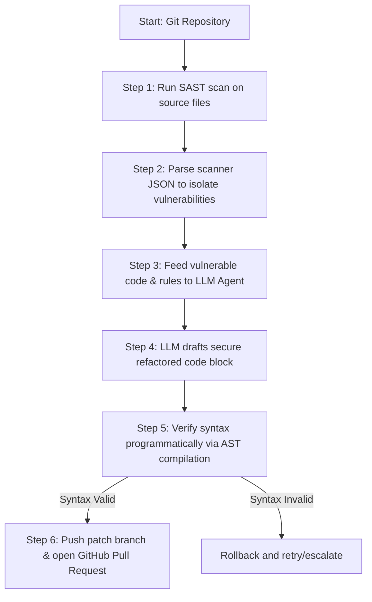

# 🛡️ Auto-Patch: AI-Agentic DevSecOps Triage Engine

Auto-Patch is an **autonomous, privacy-preserving DevSecOps agent** designed to identify, verify, and remediate code vulnerabilities end-to-end. By combining lightweight static code scanning with a stateful AI patching loop and programmatic verification, it automates the tedious process of vulnerability triage and remediation.

---

## 🚀 Key Features

*   **⚡ Lightweight SAST Scanner:** A python-native scanner that instantly parses source code for critical security flaws (like SQL Injections and hardcoded credentials) without heavy external dependencies.
*   **🤖 AI-Agentic Patching Loop:** Integrates with local LLMs (like **Qwen 2.5** via Ollama) for 100% private, local code refactoring, or connects to **Groq Cloud APIs** for high-speed cloud patching.
*   **✅ Programmatic Verification:** Every patch generated by the LLM is automatically validated using Python's native `ast.parse` compilation step, ensuring the agent never commits broken or non-compiling code.
*   **🐙 Full GitHub Pipeline Automation:** Fork target repositories, clone them locally, scan the code, apply secure patches, commit, push, and **automatically open a Pull Request** back to the original repository with a detailed markdown security report.
*   **💻 Interactive Streamlit Dashboard:** A sleek, dark-mode web interface with side-by-side unified code diffs, allowing developers to review and apply patches manually with a single click.
*   **☁️ GitHub Codespaces Ready:** Includes a `.devcontainer` configuration, allowing recruiters or developers to launch the entire project in a browser-based VS Code environment with one click.

---

## 📐 Architecture & Workflow



---

## 🛠️ Installation & Setup

### 1. Clone the Repository
```bash
git clone https://github.com/RishiKumar1917/Auto-Patch-Agent.git
cd Auto-Patch-Agent/auto_patch_agent
```

### 2. Install Dependencies
Create a clean virtual environment and install the required packages:
```bash
python -m venv venv
# On Windows:
.\venv\Scripts\Activate
# On Mac/Linux:
source venv/bin/activate

pip install -r requirements.txt
```

### 3. Configure Environment Variables
Create a `.env` file in the `auto_patch_agent` directory:
```env
GITHUB_TOKEN=your_github_personal_access_token
GROQ_API_KEY=your_optional_groq_api_key
```

---

## 🎮 How to Use

### Run the Interactive Web UI
Launch the Streamlit web dashboard:
```bash
streamlit run app.py
```
*Open `http://localhost:8501` in your browser. You can paste custom code, run security scans, click "Auto-Patch", and view the code diff before committing.*

### Run the Automated GitHub Agent
To run the autonomous agent to scan, patch, and open a Pull Request on a target public repository:
```bash
python github_agent.py <owner/repository_name> [Ollama/Groq]
```
Example:
```bash
python github_agent.py RishiKumar1917/Auto-Patch-Agent Groq
```

---

## ☁️ Launch in GitHub Codespaces
No local setup required!
1. Go to your repository on GitHub.
2. Click the green **Code** button.
3. Select the **Codespaces** tab and click **Create codespace on main**.
4. Once VS Code finishes building the environment, open a terminal inside the browser and run:
   ```bash
   streamlit run app.py
   ```
5. Click **Open in Browser** when prompted to preview the live application!
